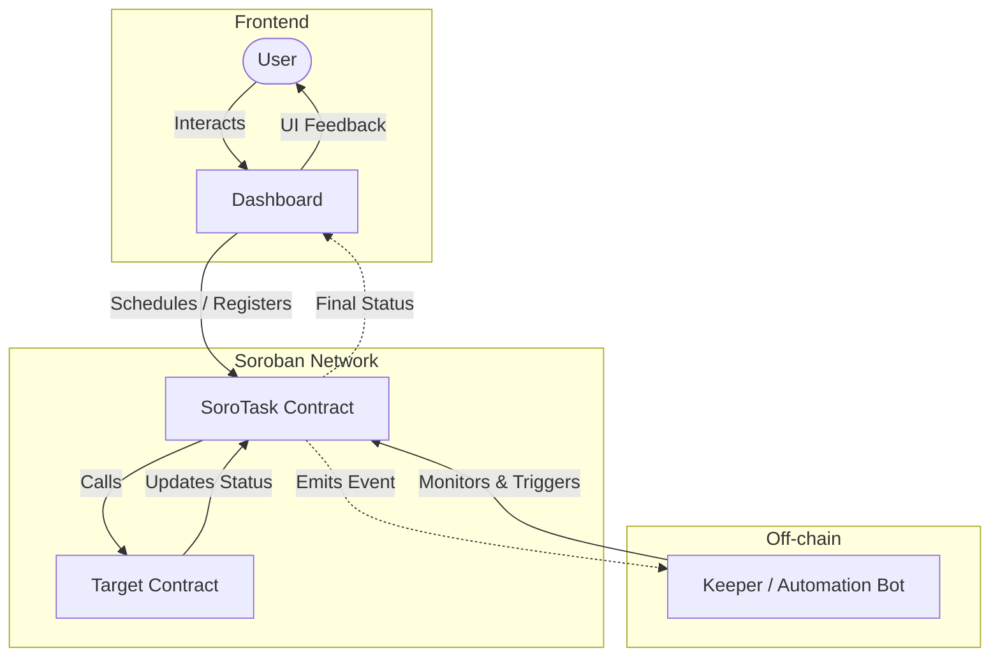

# Proof-of-Impact Funding Protocol (PIFP)

**Trust-minimized global funding. Money moves only when verifiable impact occurs.**

## Why PIFP?

Traditional donations rely on trust. PIFP uses **Stellar smart contracts** to lock funds until proof of impact is verified, replacing intermediaries with cryptographic accountability.

## How It Works

1.  **Project Created**: Creator sets funding goal and proof requirements.
2.  **Funded**: Donors deposit Bitcoin-backed assets into a Stellar pool (anonymously).
3.  **Proof**: Implementer submits proof (photos, data) to the Oracle.
4.  **Verified & Released**: Smart contract verifies proof hash and releases funds.

## Architecture

Visualizing the **User-Contract-Keeper loop**:



## Tech Stack

- **Stellar/Soroban**: Smart contract logic for conditional release.
- **Rust**: Backend oracle for proof hashing and verification.
- **React**: Frontend for project creation and funding.

## Security

- **Non-custodial**: Funds locked in contracts, not by us.
- **Privacy**: Commitment schemes hide donor identity.
- **Authentication**: Wallet signatures + OTP for critical actions.

## Impact

Zero corruption. 100% Transparency. Validated outcomes for charity and development.

## Testing

The contract logic is extensively covered by a comprehensive test suite. The test coverage validates the core lifecycle of project creation, external deposits, and oracle proof-verification logic for security boundaries.

We recently added **optimized storage retrieval patterns** to reduce gas cost and improve maintainability. New helpers like `storage::load_project_pair`, `maybe_load_project`, and `project_exists` allow high-frequency operations such as `deposit` and `verify_and_release` to read configuration and state in a single call while keeping TTL bumps minimal.
To run the automated tests using the Soroban testutils feature:

## Development
### Prerequisites
- [Rust](https://www.rust-lang.org/) (stable)
- [Soroban CLI](https://developers.stellar.org/docs/build/smart-contracts/getting-started/setup)

### Local Development
To compile the smart contracts:
```bash
cargo build --target wasm32-unknown-unknown --release
```

or 

```bash
stellar contract build
```

To run unit tests:
```bash
cargo test --manifest-path contracts/pifp_protocol/Cargo.toml
```

## Docker Development Environment

For a reproducible and isolated development environment, you can use Docker. The provided `Dockerfile` and `docker-compose.yml` set up Rust configured for Soroban smart contracts.

1.  **Start DEV environment**:
    ```bash
    docker-compose up -d dev
    ```
2.  **Open shell inside container**:
    ```bash
    docker-compose exec dev bash
    ```
3.  **Run sanity check**:
    ```bash
    ./scripts/devops_check.sh
    ```
4.  **Build or Test**:
    ```bash
    cargo test --manifest-path contracts/pifp_protocol/Cargo.toml
    ```

### CI/CD Workflow
This project uses **GitHub Actions** to automate validation. On every push and pull request to `main` and `develop`, the following checks are performed:
1.  **Format Check**: Ensures code follows `rustfmt` standards.
2.  **Linting**: Strict `clippy` checks to catch common errors and ensure best practices.
3.  **Unit Tests**: Executes the full test suite to guarantee logic correctness.
4.  **WASM Build**: Verifies that the contract can be successfully compiled for the Soroban runtime.

Successfully built WASM artifacts are available in the action's execution summary.
